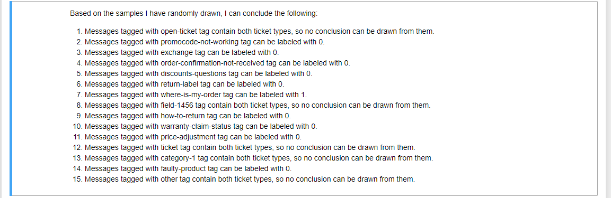
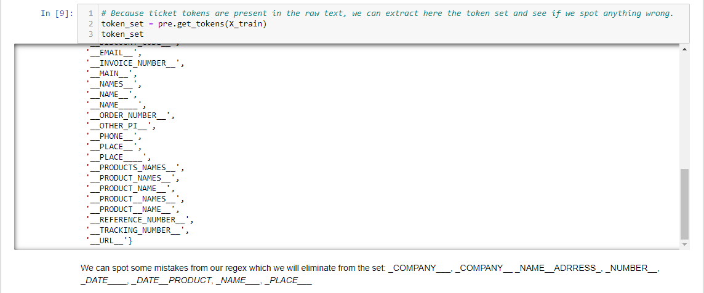
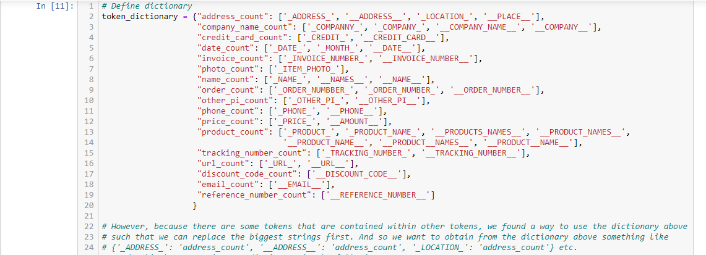
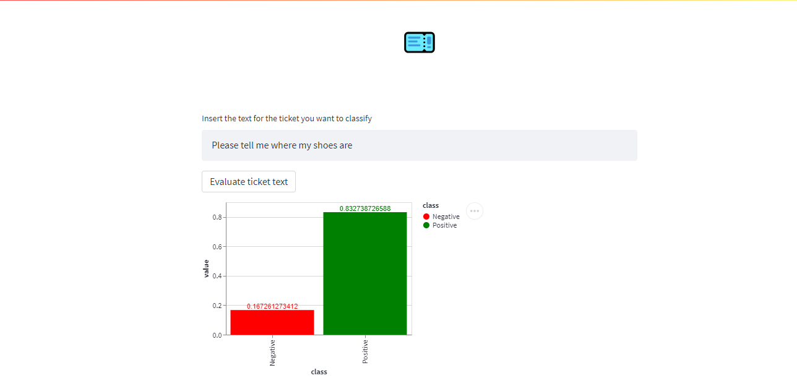
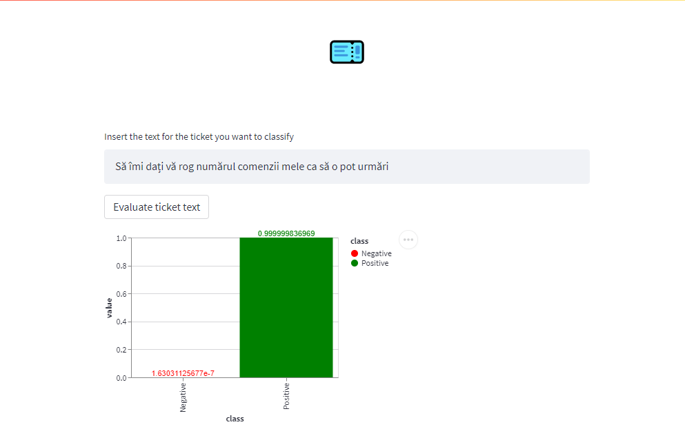

<h1 style="text-align: center"> Ticket Classifier </h1>

## Business Case

Using a sample of e-commerce customer support data we want to build a model which correctly classifies
tickets as of type "where is my order" and those that are not this type.
Tickets in this category include tickets referring to questions like "How can I get a tracking number to track my order?",
"When tracking my order, it says it has arrived but I have never received it.", "When will my order ship?".

Building this porject was a technical test that I have received and decided to turn it into a project. You can see the requirements
at [this page](technical%20test.pdf).

This type of classifier will reduce the human interaction with tickets down to where it is needed: solving the actual ticket.
In this matter, our goal with this project is to find a classifier such that it emphasizes on having a great recall for the
positive class, as it is more important to not classify a positive class as negative than it is to not classify a negative
class as positive.

## Table of Contents

Show/Hide

1. [File/Folder descriptions](#1-filefolder-descriptions)
2. [Data preparation](#2-data-preparation)
3. [Preprocessing and modeling](#3-preprocessing-and-modeling)
    * [Preprocessing](#31-preprocessing)
    * [Modeling](#32-modeling)
    * [Experiment](#33-experiment)
4. [Web application](#4-web-application)
5. [Conclusion](#5-conclusion)

## 1. File/Folder descriptions

Show/Hide

* **data**: Folder in which we store all our data to be used in either notebooks, either python scripts.
    * labeled_tickets: Data file containing all the tickets in csv format. They are comprised of text and label.
	* technical_test_data.json: Data file containing raw data about the tickets (text, id, tags etc.).
	* token_dictionary.json: Data file containing a python dictionary that has key: value as token: token_group.
	* **modeling**: Folder in which we store all the models/scalers/tfidfvectorizers to be used later.
		* model_1_with_mf.pkl: ML model which uses manual features and text in predictions.
		* model_2_with_mf.pkl: ML model which uses manual features and text in predictions.
		* scaler_1.pkl: Scaler that should be used for manual features before predicting with model 1.
		* scaler_2.pkl: Scaler that should be used for manual features before predicting with model 2.
		* tfidf_1.pkl: Tf-idf vectorizer that should be used for text before predicting with model 1.
		* tfidf_2.pkl: Tf-idf vectorizer that should be used for text before predicting with model 2.
* **notebooks**: Folder in which we put all of the jupyter notebooks and python scripts associated with them.
	* **scripts**: description
		* **development**: description
			* \__init__.py: Necessary to import script as module.
			* preprocessing.py: Script in which we documented all the functions used to preprocess the ticket texts.
			* experiment.py: Script in which we documented all the functions used in the "Experiment" part in the "Preprocessing and modeling" notebook.
		* **test**: Folder in which we have tests for the functions used in the development folder.
			* test_preprocessing: File in which we have tests for all of the functions in preprocessing.py that require it.
			* test_experiment: File in which we have tests for all of the functions in experiment.py that require it.
			* \__init__.py: Necessary to import script as module.
		* **\__init__.py: Necessary to import script as module.
	* \__init__.py: Necessary to import script as module.
	* 1. Labeling the data.ipynb: Notebook which describes the process of finding the target label.
	* 2. Preprocessing and modeling.ipynb: Notebook which describes the process of cleaning the data and finding a good model.
	* 3. Evaluating the models.ipynb: Notebook in which we tested our best models with random data created by us and chose the bets one.
  * 4. Predict.ipynb: Notebook in which we can test the model for input given by the user.
* **presentation_images**: Folder in which images of the project used in the README file are stored.
* **client**: Folder in which I have files used for the streamlit application.
  * \__init__.py: Necessary to import script as module.
  * app.py: The script used to start the application.
  * app_functions.py: Script containing functions used in the application.
* README.md: File which described the purpose and the findings of the project.
* technical test.pdf: Project requirements document.

## 2. Data preparation

Show/Hide

The data provided was composed out of around 1500 entries, and none had any label. In order to be able to classify
them correctly, we first needed to decide how to label them. Therefore, the first step was to look through the data
and check which columns are useful and which are not. Lots of columns were redundant and one of them was useful in
finding an actual label: the 'tags' column.

I have removed all unnecessary columns and then I started to explore the tags. While doing this, I have decided to
group messages by tags. Then, to make sure that tags are really meaningful, for tags that had less than 30
messages, I manually checked if all the messages are of type 'where is my order'. If not all messages in that tag
group were of the same class, I just classified them individually. For tags with more than 30 messages, I took a sample
of 10% of the messages and checked their type manually.

  

 
 

In the end I had the final data set saved in a .csv file, with all the messages correctly labeled and ready to be
further processed.

## 3. Preprocessing and modeling

Show/Hide

After having all the tickets correctly labeled, we needed to do some text processing in order to be able to
use this data to classify future tickets. During this phase, I had also explored the structure of ticket text
and observed that not all tickets are in English and many of them had some sort of tokens (i.e. \_PRODUCT_NAME_, \_EMAIL_).
Furthermore, I saw that it was an imbalanced dataset (the positive class was around 12% of the total samples). So this was
also something to keep in mind.

### 3.1 Preprocessing

Show/Hide

In this step I tried to clean the text data and make it useful for the modeling phase. The techniques I used on the text are:

1. Measure text length and add it to manual_features list at index 0.
2. Measure number of words and add it to manual_features list at index 1.
3. Measure average word length and add it to manual_features list at index 2.

4. Use function correct_spelling to try to correct the errors in the text.  
5. Use function expand_contractions to expand word like won't and don't to will not and do not.  
6. Measure the numeric counts of each message (the count of number values present in each message)
and add it to manual_features at index 3.  
7. Measure the number of each token from token_dictionary found in text and add these values to manual_features
list; remove them from text after counting to avoid counting token multiple times
(i.e. a token that can fit inside other token)  
8. Convert text to lowercase.  
9. Count number of emails in each message and remove them.  
10. Count and remove any url from the text.  
11. Count and remove the number of stopwords from the text.  
12. Remove single characters and special characters from text.  
13. Stem the remaining words.

I have done all of these steps for 2 reasons: clean the text so that we have fewer words and a model can be
trained in a timely manner using tf-idf and create a list of manual features and see if they improve the outcome
of the model.

One interesting part was the extraction of tokens and figuring out how to use them.

  

 
 

  

 
 

Then, by using the preprocessed text, I used tf-idf to convert to numerical features that could be used
for training a model. I wanted to see if the manual features helped or not, so I created a function
that would give me the manual features by default, but there was an option not to append them to the
tf-idf result matrix.

### 3.2 Modeling

Show/Hide

Here I have encountered 2 major issues: what kind of model should I use? and how do I deal with an imbalanced dataset?

Firstly, as with any non deep learning model, it is useful to divide your data into training and test (validation was
done using k-fold training). Therefore I had a training set to fit my model on and a test set to see if it performs well.

Secondly, after doing a little bit of research I have found that 5 good models to be used for NLP are: NaiveBayes, Linear SVM,
LogisticRegression, SGDClassifier. And then I added a RandomForestClassifier because it is usually doing well on all kinds of tasks.
So I figured out I can use it at least as some kind of landmark.

For the second problem, I have also searched "far and wide" and found that my problem can be solved by oversampling, undersampling,
or a mix of the two. This was done here using a library called imblearn.

In order to evaluate my models I have used a metric defined in sklearn: average_precision as my main metric. This value summarizes the
precision-recall curve and is a much better indicator than accuracy, especially for imbalanced datasets.

I have then created functions that would evaluate my models on different types of samplings, on data without sampling and also
on data with or without manual features. I chose the best model based on the scores on the kept-out test set and saved it into the
[data folder](./data/modeling).

  

 
 

Training results were great, even on the validation set, but the results on the kept-out test set were different.
It looked like the model has overfit the training set. Looking back on the project, perhaps something like keeping only
the x most frequent words would be a solution to deal with the overfitting problem. But in this case, I decided to go
another route.

### 3.3 Experiment

Show/Hide

When reading about how to deal with imbalanced data sets in NLP, I have came across an article that talked about
the power of translation. Different words in a sentence can have the same meaning. What I needed in this project
was for the whole sentence to keep its meaning, regardless of the words used.

So this experiment that I have done was to translate from English into another language and then back to English,
and to rely on the translator that would give me different words but maintaining the overall meaning of the phrase.
For this I have used a python library which accessed the google translator API. In order to balance the data set I
figured out I needed to translate into 6 languages and back again.
Then I would train my models on the new dataset and try to hypertune them if possible.

Adding the best model from this part gave me 2 main models.
In order to decide between the 2, I have created a manual test set and based on that, decided which one to
use for the main application.

## 4. Web application

Show/Hide

In order to be able to test the final model easier, I have created a streamlit application
for testing different ticket texts. It has a main text input in which you can insert text,
a button that starts the evaluation and then a graph to tell you the confidence that that
ticket is of type "where is my order". It is marked with green, as the positive class.
If the ticket is not of that type, it will be more on the negative class, marked with red.

  

 
 

  

 
 

Steps to follow if you want to run the application on your machine:

1. Pull this repository from git
2. Make sure you have python and pip installed
3. Install streamlit and numpy using pip
4. Go to the client directory of this project, open a command line and type
"streamlit run app.py"
5. The web app should be accessible now at http://localhost:8501 or the provided link in your console

## 5. Conclusion

Show/Hide

NLP can be useful in many tasks, as it can be used to ease the jobs of people, letting them deal with
important work, instead of doing mundane tasks. This project started off as a tech challenge,
but it has been an exciting journey into the NLP domain.

I managed to learn about NLP fundamentals, how to deal with imbalanced data sets and
most importantly, how to respect a deadline and how to approach the problem from different angles.
I enjoy the learning process as much as the feeling of having something done that is actually
working and could be used to help people.

